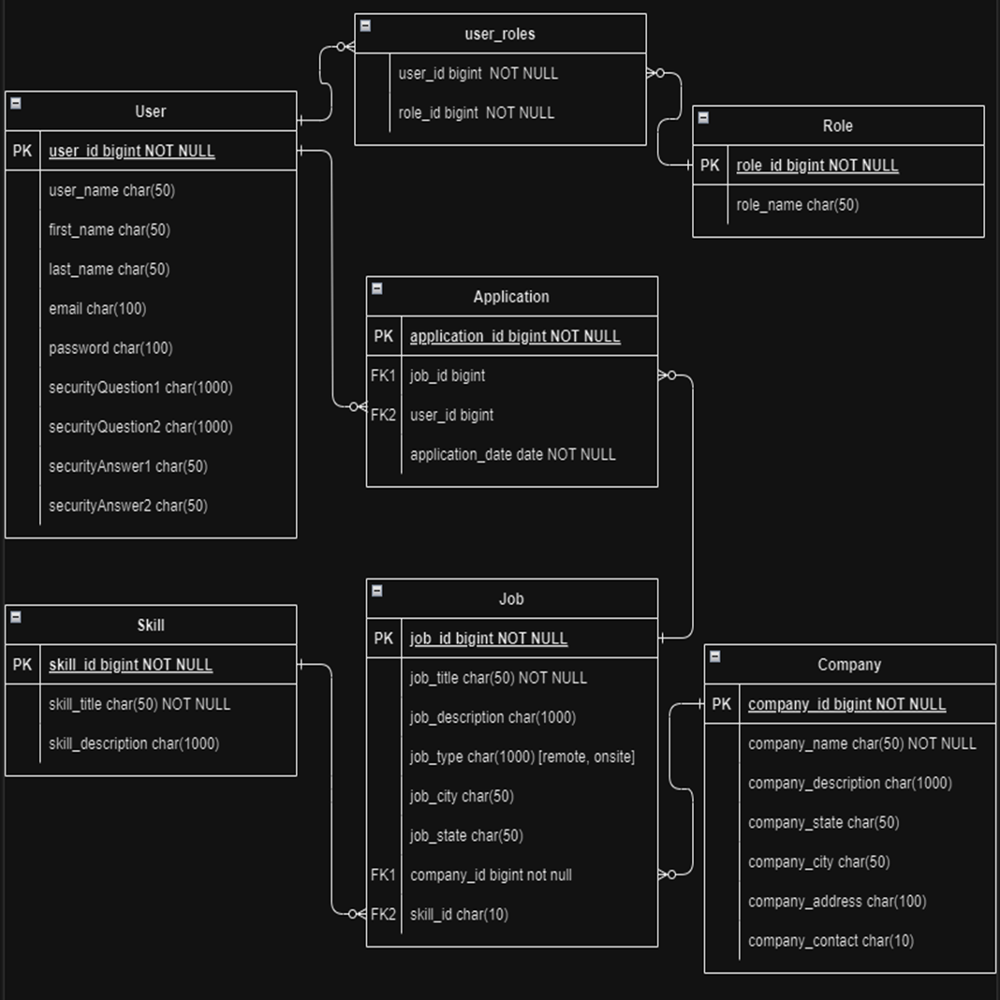

# JobHive

## Project Overview

Job Hive is an application connecting jobseekers and recruiters. Recruiters can post new job openings, while jobseekers can search and apply for these positions. The platform aims to streamline the job application process, making it easier for candidates to find opportunities and for employers to discover talent.

The primary goal of JobHive is to provide users with the following features:

* Job Posting: Recruiters can easily create and manage job listings.

* Job Search: Jobseekers can search for jobs using various filters like location, company, skills.

* Job Applications : Jobseekers can also apply to the jobs posted by recruiters making it easy for the recruiters to source talent. 

## Tech Stack:
* Frontend: HTML, CSS, ThymeLeaf 
* Backend: Springboot
* Database: MySQL

# 1: Technology Stack Setup Notes (Windows)
## [Download and Install Intellij IDE](https://youtu.be/XlWtdqYNc60?si=2UVXHHDN47BZ6dVQ)
         -Intellij offers free 1 year ultimate version for university students. Follow this link to apply, approval time is instant
         -https://www.jetbrains.com/community/education/#students

         -If you wish to use free(community) edition that is fine too. Use the video as your guide.  

## [Install java 21](https://youtu.be/-hxCPXjYWJU?si=plULG5Kk8pckcWAi)

## [Install MySQL workbench](https://youtu.be/6kFPgtL5zqU?si=0ANN6eTi9XrSKSWo)

# Help Section 

## [Getting started with GitHub on Intellij](https://youtu.be/LA7fYgNXbg0?si=5r4uf3wJe_QSIf8G)
## [Understanding maven project structure](https://youtu.be/YHKShv0EtDA?si=V3GVJfYimoCw1lQt)
## [Simple CRUD using springboot and MySQL - Lecture series](https://www.youtube.com/watch?v=yoZpl-iBzs4&list=PLGRDMO4rOGcM7B0TsM_-2efML7LAOriWV&index=6)
## [Spring boot additional content](https://youtu.be/Fit3-k3836Y?si=8MrGwvp8se_oeQ3P)

# Database setup

# API documentation

Spring swagger docs - http://localhost:8080/swagger-ui/index.html